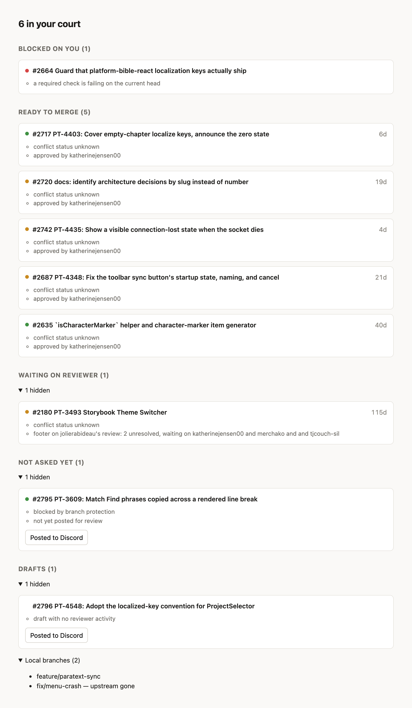
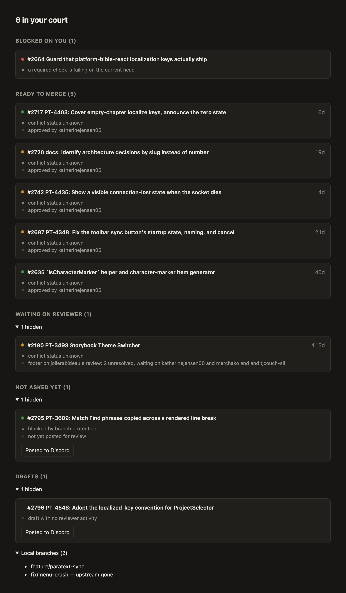

# PR Dashboard

A local dashboard that answers one question about your open pull requests: **whose
court is the ball in?** It polls GitHub, sorts your PRs into prioritized buckets
(blocked, needs your response, ready to merge, waiting on a reviewer, …), shows the
receipts behind every verdict, and notifies you when a PR changes court.

It runs entirely on your machine. Each person runs their own copy, tracking their own
GitHub login.

| Light | Dark |
| --- | --- |
|  |  |

*Both shots are `npm run demo` — the nine captured PRs in `tests/fixtures/`, not live
data. You can run exactly this yourself before configuring anything.*

## What you can do with this repo

| I want to… | Do this |
| --- | --- |
| See what the board looks like, with no setup | `npm install && npm run demo` |
| Track my own PRs | Configure `config.json`, then `npm run dev` |
| Understand why a PR landed in a bucket | Read the receipts on its card — every verdict explains itself |
| Stop a PR nagging me from "not asked" | Click **Posted to Discord** on the card |
| Change how PRs are classified | Edit a rule in `src/rules/`, add a fixture test |
| Check my changes didn't break classification | `npm test && npm run typecheck` |
| Refresh the captured PRs the tests run against | `npx tsx scripts/capture-fixtures.ts 2717 2720 …` |

## Try it without any setup

```bash
npm install
npm run demo
```

Open <http://localhost:5173>. This serves a board built from the nine real PRs
captured in `tests/fixtures/`, pinned to a fixed clock so it looks the same every
time. It never contacts GitHub, never shells into a clone, never calls Claude, never
sends a notification, and never writes to your database — so it works before you have
a `config.json`, and it is safe to leave running.

Demo mode is also what produces the screenshots above.

## Prerequisites

Node is needed for everything, including the demo. The rest are needed only for
the real board (`npm run dev`).

| | |
| --- | --- |
| **Node 22+** | Needed even for the demo: `npm install` builds the `better-sqlite3` native module, and an older Node fails at that step. |
| **GitHub CLI, logged in** | The server reads your token from `gh auth token` at startup. Run `gh auth login` first. No token is ever stored in this repo. |
| **A local clone of the repo you're tracking** | The branch list reads it with `git -C`. Nothing is written to it. |
| **`ANTHROPIC_API_KEY`** | Optional. Used only to break ties on ambiguous reviews — see [Review escalation](#review-escalation). |
| **macOS, for notifications** | The board itself works everywhere; desktop notifications don't. See [Known limits](#known-limits). |

## Quickstart

```bash
npm install
cp config.example.json config.json   # then edit it — see below
npm run dev
```

Open <http://localhost:5173>.

`npm run dev` starts two processes: the API on port 5174 and the Vite dev server on
5173, which proxies `/api` to the API. On startup the server prints which login and
repo it is tracking — check that line says *you*.

## The buckets

Every open PR lands in exactly one bucket. The first three are **your court** — they
are what the "N in your court" headline counts, they render expanded, and they are the
ones that can raise a notification. The rest collapse to a one-line summary you can
click open.

| Bucket | What puts a PR here |
| --- | --- |
| **Blocked on you** | A merge conflict, or a required check failing on the current head. Outranks everything, including a clean approval. |
| **Needs your response** | A reviewer acted after your last activity — or their Reviewable footer names you in "waiting on". |
| **Ready to merge** | An explicit approval with nothing after it, or a footer reporting all files reviewed and all discussions resolved. |
| **Waiting on reviewer** | You acted after their last activity, or the footer names someone else. |
| **Asked, nobody has looked** | You marked it posted to Discord and no reviewer has touched it since. Past `staleAfterHours` the card says to re-ping. |
| **Not asked yet** | No review activity has ever happened and you haven't posted it for review. |
| **Drafts** | A draft nobody has reviewed. Stays quiet — unless you mark it posted, which moves it to "asked, nobody has looked". |

Below the buckets is a plain list of your **local branches**, with `— upstream gone`
marked on any whose remote has been deleted. It is deliberately not a claim about
unsubmitted work: the GraphQL query doesn't fetch `headRefName`, so there's no honest
way to match a branch to its PR. A gone upstream is the only distinction the data
supports.

## Using the board

**Receipts.** Every card lists the evidence behind its bucket — which footer was read,
who acted last, which check is red. If a verdict looks wrong, the receipts tell you
which rule produced it.

**The check dot.** Red is a failing required check, amber is still running, green is
all complete and passing, and no dot means the PR has no checks at all. A rolled-up
`FAILURE` is not trusted on its own, because a run that was merely *cancelled* rolls
up that way.

**Posted to Discord.** On "not asked yet" and draft cards, this button stamps the PR as
asked-for-review and starts the staleness clock. That moves it to "asked, nobody has
looked" and stops it reading as something you've forgotten to send out. The stamp is
local to your database, not anything posted to GitHub or Discord for you.

**Notifications** fire when a PR *arrives* in "needs your response", "blocked on you",
or "ready to merge", and when a Discord-posted PR goes stale. They are debounced 15
minutes and only re-fire when a PR actually changes state, so a PR sitting still stays
quiet. Clicking one opens the PR.

**Staleness.** If the API can't be reached the board keeps showing the last good data
behind a banner saying so, and keeps retrying every 30s rather than blanking out.

## Configuration

`config.json` is gitignored, so your copy stays yours. Every field is required.

| Field | Meaning |
| --- | --- |
| `repoPath` | Absolute path to your local clone. Used for the branch list. |
| `owner` / `name` | The GitHub repo to poll, e.g. `paranext` / `paranext-core`. |
| `me` | **Your** GitHub login. This is what "your court" is measured against. |
| `botLogins` | Logins whose reviews and comments don't count as human activity. |
| `pollIntervalMs` | How often to poll GitHub. Minimum 30000; 180000 (3 min) is the default. |
| `staleAfterHours` | How long a PR sits unlooked-at before the Discord nudge goes stale. |

The example file ships with placeholders in angle brackets for the two fields that
must be yours. The server refuses to start while any placeholder is left in place, and
refuses to start if `repoPath` doesn't exist — both produce a message naming the field.

Environment overrides, all optional:

| Variable | Default |
| --- | --- |
| `PRD_CONFIG` | `config.json` |
| `PRD_DB` | `pr-dashboard.db` |
| `PORT` | `5174` (the API; the web port lives in `client/vite.config.ts`) |

## Review escalation

Most reviews are classified deterministically from the Reviewable footer and review
timestamps. Two cases are genuinely ambiguous — a `COMMENTED` review with no footer,
and an approval whose body still asks for changes — and those are sent to Claude to
decide whose court the PR is in. Verdicts are cached in SQLite per review revision, so
each review is escalated at most once.

This needs `ANTHROPIC_API_KEY` in your environment. **Without it the dashboard still
works**: the ambiguous PR falls back to its deterministic bucket and the card says the
tie-break is unavailable. Nothing crashes and nothing is retried in a loop.

## Architecture

```
src/
  rules/      classification — pure functions, no I/O. Start here.
    classify.ts   picks the bucket and writes the receipts
    footer.ts     parses the Reviewable footer
    activity.ts   who acted last, ignoring bots and bare merges of main
    checks.ts     failing checks, the check dot, conflict state
    notify.ts     what a notification is keyed on
  github/     GraphQL query, client, and `gh auth token` lookup
  git/        reads local branches via `git for-each-ref`
  claude/     tie-breaks the two ambiguous review shapes
  store/      SQLite: Discord stamps, cached verdicts, notification state
  notify/     macOS notifications via `osascript`
  server/     Fastify routes, the poll loop, demo mode, and dev-server lifetime
client/src/   React board — App, Card, bucket labels and ordering
```

The seam worth knowing: `buildBoard()` in `src/server/poller.ts` is a pure function of
`(prs, branches, store, config, now)`. The poller wraps it with network I/O; demo mode
feeds it fixtures. That's why the demo needs no GitHub access.

**To change how PRs are classified**, edit `src/rules/classify.ts` and add a case to
`tests/classify-fixtures.test.ts`. Because the fixtures are real captured PRs, a rule
change that breaks a real-world case fails the suite.

**To add a new bucket**, it needs a `Bucket` member in `src/types.ts`, an entry in
`ORDER` in `src/server/poller.ts`, and a label in `client/src/buckets.ts`.

## Development

```bash
npm test          # vitest, one pass
npm run test:watch
npm run typecheck
```

Both servers stop themselves when whatever started them — `run-p`, or the terminal —
goes away, so a half-collapsed `npm run dev` can't leave an API behind holding port
5174. If the port is taken anyway, startup says which pid holds it instead of throwing
an `EADDRINUSE` stack trace. See `src/server/lifecycle.ts`.

Classification is covered by unit tests plus fixture tests built from nine real PRs in
`tests/fixtures/`. `scripts/capture-fixtures.ts` refreshes them — pass the PR
numbers to recapture, e.g. `npx tsx scripts/capture-fixtures.ts 2717 2720`. It needs
an authenticated `gh`.

## Known limits

- **Notifications are macOS-only.** They shell out to `osascript`. On Linux and
  Windows `notify()` is a no-op and the server says so once at startup — the board,
  buckets, and receipts all work normally; you just have to look at the tab.
- **One user per checkout.** `me` is a single login, and the SQLite file holds that
  person's notification and Discord state. Teammates each clone and configure their
  own; don't share a working copy.
- **Polling, not webhooks.** Changes show up within one `pollIntervalMs`, not
  instantly.
- **`gh` is required at startup.** If it's missing or logged out, the server exits
  with an actionable message rather than running blind. Demo mode doesn't need it.
- **Branches aren't matched to PRs.** See [The buckets](#the-buckets).
